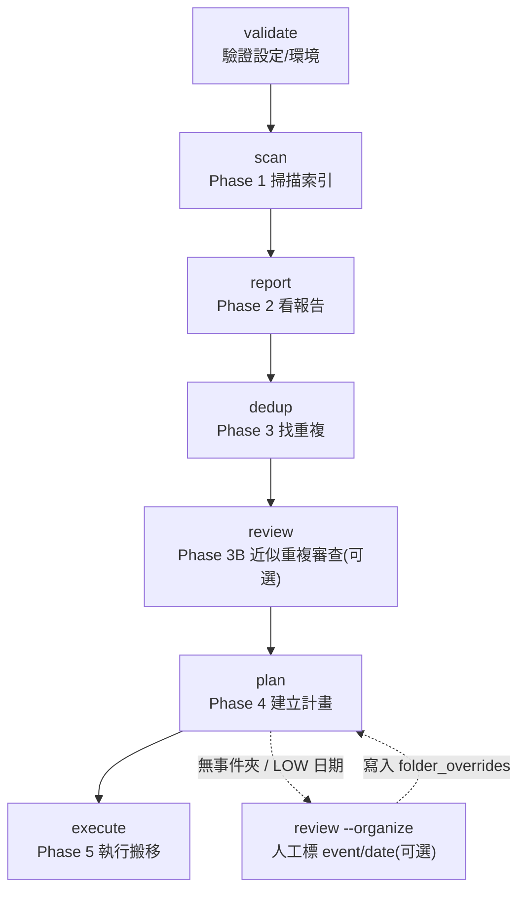
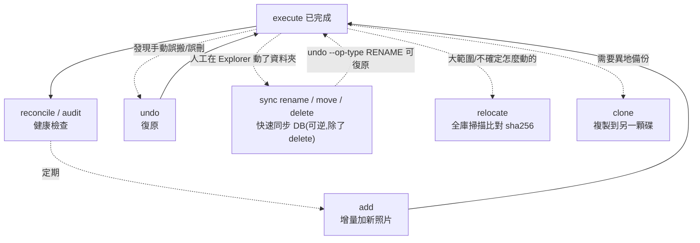
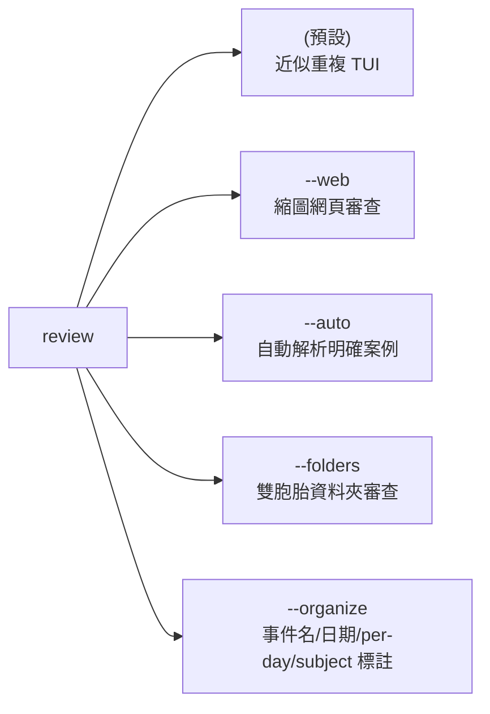
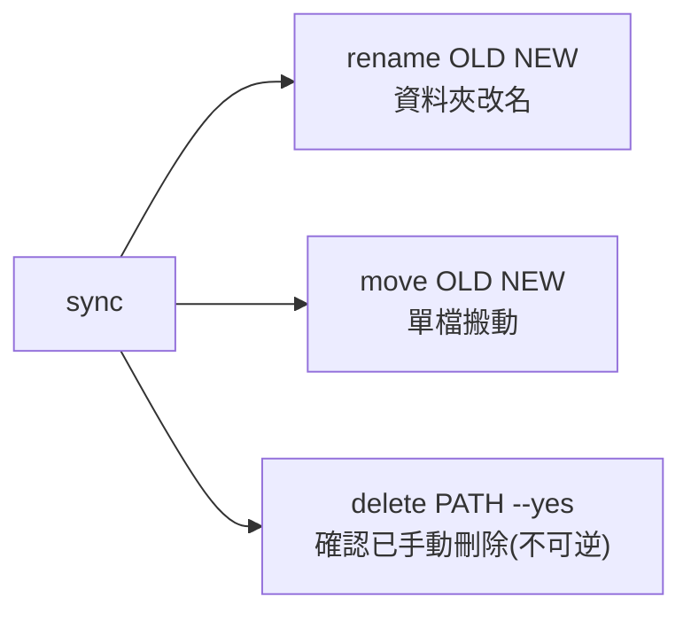

# Photo Organizer 指令手冊

本文件目的:**查指令該怎麼用,不用回頭翻 code。** 完整的需求/架構/設計決策說明見 [SKILL.md](../SKILL.md);專案規約與文件分工見 [CLAUDE.md](../CLAUDE.md)。

> 共 18 個頂層指令(`review`、`sync` 各有多個子模式)。每個指令都接受 `--config config.json`(建議)或 `--db <path>` + 個別旗標。

---

## 目錄

1. [整體流程圖](#整體流程圖)
2. [指令總表(快速查詢)](#指令總表快速查詢)
3. [情境教程](#情境教程)
   - [A. 第一次建庫](#a-第一次建庫從零開始)
   - [B. 日常增量維護](#b-日常增量維護加新照片)
   - [C. 定期健康檢查](#c-定期健康檢查)
   - [D. 手動編輯資料夾後同步-db](#d-手動編輯資料夾後同步-db)
   - [E. 異地備份](#e-異地備份)
   - [F. 例外分流p3-triage](#f-例外分流p3-triage)
   - [G. 復原誤搬誤刪](#g-復原誤搬誤刪)
   - [H. 選擇性分批執行](#h-選擇性分批執行)
4. [各指令詳細參考](#各指令詳細參考)
5. [`--force` 與已完成檔案的互動(重要)](#force-與已完成檔案的互動重要)
6. [常用查詢與慣例](#常用查詢與慣例)

---

## 整體流程圖

### 核心建庫流程(Phase 1–5)



### 建庫之後的生命週期



### `review` 的 5 種模式



### `sync` 的 3 種子動作



---

## 指令總表(快速查詢)

| 指令 | 屬於 | 一句話 | 改 DB? | 改磁碟? | 可重複跑? |
|---|---|---|---|---|---|
| `validate` | 建庫前 | 跑前環境檢查(config/ExifTool/sample scan) | 否 | 否 | 是 |
| `scan` | Phase 1 | 掃描來源、寫入 DB、讀 EXIF | 是 | 否 | 是(增量) |
| `report` | Phase 2 | 印掃描統計報告 | 否 | 否 | 是 |
| `dedup` | Phase 3 | 找 EXACT(SHA-256)+ NEAR(pHash)重複 | 是 | 否 | 是 |
| `review` | Phase 3B | 人工審查近似重複 / 雙胞胎資料夾 / 事件標註 | 是(`folder_overrides`/`duplicates`) | 否 | 是 |
| `plan` | Phase 4 | 算出完整搬移計畫,需 `y` 確認 | 是(`operations`) | 否 | `--force` 重建 |
| `execute` | Phase 5 | 真正搬檔(`os.rename`,同碟瞬間完成) | 是 | **是** | 是(分批) |
| `add` | 維護 | 增量加新照片,對全庫去重,不動已整理好的 | 是 | 是 | 是 |
| `undo` | 救援 | 把已搬檔案搬回原位 | 是 | **是** | 是(分批) |
| `sync` | 維護 | 人工動過資料夾後,快速校正 DB(不重掃) | 是 | 否(只讀) | 是 |
| `relocate` | 維護 | 大範圍/不確定的人工搬動,靠 sha256 比對全庫找回 | 是 | 否(只讀) | 是 |
| `clone` | 備份 | 複製整理好的庫到另一顆碟,驗證 hash | 是(run_log 報告) | 是(目的端) | 是(增量) |
| `reconcile` | 健康檢查 | 守恆證明:每個檔案剛好一個終態 | 否(除非異常記 log) | 否 | 是 |
| `audit` | 健康檢查 | DB 一致性稽核(殘留命名、懸空參照…) | 是(清空+重寫 run_log) | 否 | 是 |
| `unknown-cameras` | 診斷 | 列出無相機型號的檔案分佈 | 否 | 否 | 是 |
| `reclassify` | 維護 | 用已存的 EXIF 重跑分類(不讀碟) | 是 | 否 | 是 |
| `folder-merge` | 例外 | 偵測整批複製的雙胞胎資料夾 | 是(`folder_overlaps`) | 否 | 是 |
| `timings` | 診斷 | 看各指令耗時歷史 | 否 | 否 | 是 |

---

## 情境教程

### A. 第一次建庫(從零開始)

```bat
:: 1. 寫 config.json(input_dirs / target / db),然後驗證環境
python -m photo_organizer validate --config config.json

:: 2. 掃描 → 看報告 → 找重複
python -m photo_organizer scan    --config config.json
python -m photo_organizer report  --config config.json
python -m photo_organizer dedup   --config config.json

:: 3.(可選)人工審查近似重複,網頁版較直覺
python -m photo_organizer review --web --db C:\photos.db

:: 4.(可選)無事件/低日期資料夾先標好,plan 才會用到
python -m photo_organizer review --organize --db C:\photos.db

:: 5. 建計畫(會自動先跑日期鑑識),輸入 y 確認
python -m photo_organizer plan --config config.json

:: 6. 執行搬移(同碟 os.rename,瞬間完成)
python -m photo_organizer execute --config config.json

:: 7. 健康檢查
python -m photo_organizer reconcile --db C:\photos.db --verify-disk
python -m photo_organizer audit     --db C:\photos.db
```

### B. 日常增量維護(加新照片)

庫已經整理好,新增一批照片進來,**不會**重新整理已經搬好的東西:

```bat
python -m photo_organizer add E:\Photos\2024-07 --target E:\Organised --db C:\photos.db
:: 或用 config(來源取自 input_dirs)
python -m photo_organizer add --config config.json --yes
```

`--no-execute` 只建計畫不搬,之後再 `execute`。

### C. 定期健康檢查

```bat
:: 快(DB-only):每次 plan/execute 前後都可以跑
python -m photo_organizer reconcile --db C:\photos.db
python -m photo_organizer audit     --db C:\photos.db

:: 慢(讀碟,確認磁碟上真的有檔):偶爾跑一次,或備份前跑
python -m photo_organizer reconcile --db C:\photos.db --verify-disk
```

`audit` 若有 **ERROR** 級的發現,代表 DB 本身有問題,**先處理再相信任何 plan 結果**;**WARN** 級多半下次 `plan --force` 會自己修好(看 `audit` 印出的 fix hint)。

### D. 手動編輯資料夾後同步 DB

已經 `execute` 過,你在 Explorer 裡手動改了東西——**先動資料夾,再回來跑指令**:

```bat
:: 改了資料夾名字(例如修正事件名)
ren "D:\Media\Masters\2020\2020-01-12 三貂嶺_小蜂" "2020-01-12 三貂嶺"
python -m photo_organizer sync rename "D:\Media\Masters\2020\2020-01-12 三貂嶺_小蜂" "D:\Media\Masters\2020\2020-01-12 三貂嶺" --db C:\photos.db

:: 移了單一檔案(例如把錯放的一張歸到另一個事件)
python -m photo_organizer sync move "D:\Media\Masters\2020\EventA\IMG_0001.JPG" "D:\Media\Masters\2020\EventB\IMG_0001.JPG" --db C:\photos.db

:: 確認某檔案是手動刪掉的(不會復原位元組,只是讓 DB 別再誤報)
python -m photo_organizer sync delete "D:\Media\Masters\2020\EventA\junk.JPG" --db C:\photos.db --yes
```

**`rename`/`move` 可逆**:`undo --op-type RENAME --db C:\photos.db --force` 直接搬回去。`delete` 不可逆(位元組真的沒了)。

`sync` 是「直說、不偵測」——你明確告知舊/新路徑,**不掃全庫**,秒級完成。如果是大範圍、自己也不確定怎麼動的,改用：

```bat
python -m photo_organizer relocate D:\Media --db C:\photos.db
```

(會掃整個 `files` 表比對 sha256,大庫上可能要幾分鐘。)

### E. 異地備份

```bat
python -m photo_organizer clone E:\Backup --target D:\Media --db C:\photos.db
:: 偏執模式:重新驗證目的端每一個檔(慢)
python -m photo_organizer clone E:\Backup --target D:\Media --verify-all
```

只複製、絕不搬移/刪除來源。重跑只處理新增/變動的檔(增量、快)。

### F. 例外分流(P3 triage)

無事件資料夾、LOW 日期、日期分散的多日夾、意外被歸類成 Subject 的資料夾——一年一年清,不用面對全庫:

```bat
python -m photo_organizer review --organize --year 2020 --db C:\photos.db
```

開啟的網頁有四區塊:無事件/低日期卡片(填 event/date)、依日分夾候選(勾選)、日期分散提醒(唯讀,提示用 `relocate`/`sync` 修)、Subject 確認(按鈕確認一次,以後不再提醒)。

**建議時機:`execute` 之後、分批處理**(`execute --year 2020` → 看 `D:\Media\*\2020\` 實際結果 → 用 D 情境的 `sync` 修 → 下一年)。例外:LOW 日期校正建議 execute **前**做(下次 plan 直接用對的日期,不用多一道 `sync move`)。

### G. 復原誤搬誤刪

```bat
:: 全部復原
python -m photo_organizer undo --db C:\photos.db

:: 只復原某個條件(可組合,跟 execute 的篩選一致)
python -m photo_organizer undo --db C:\photos.db --year 2023
python -m photo_organizer undo --db C:\photos.db --op-type STAGE_DELETE   :: 只救回誤判要刪的檔
python -m photo_organizer undo --db C:\photos.db --op-type RENAME        :: 只復原 sync 做的人工校正
```

### H. 選擇性分批執行

庫很大,想分批搬,確認沒問題再搬下一批:

```bat
python -m photo_organizer execute --db C:\photos.db --year 2023
python -m photo_organizer execute --db C:\photos.db --camera ILCE-7RM2
python -m photo_organizer execute --db C:\photos.db --software Lightroom
python -m photo_organizer execute --db C:\photos.db --type DEV_JPEG
```

沒搬完的維持 `confirmed`,`execute` 不需要 `--force` 就能重複執行接續搬。

---

## 各指令詳細參考

> `--config PATH` / `--db PATH` / `--force` 三個旗標所有指令都有(`shared`),以下只列各指令**專屬**的旗標。`--db` 永遠優先於 config;若兩者都沒給但給了 `--target`,DB 預設落在 `{target}/.photo_organizer/library.db`。

### `validate`
**何時用**:第一次設定 config.json 後,或改了設定,跑正式流程前先確認。
不讀寫真實 DB(用拋棄式記憶體 DB),只跑 sample scan。

### `scan` — Phase 1
**何時用**:建庫的第一步,或 `add` 內部自動呼叫。
| 旗標 | 說明 |
|---|---|
| `ROOT_PATH`(位置參數) | 單一來源目錄(用 config 的 input_dirs 則省略) |
| `--workers N` | 平行 ExifTool 執行緒(預設 4,SSD 可加大) |
| `--secondary` | 啟用次要 resized-JPEG 訊號(先看過 report 再開) |

中斷可重跑,自動跳過已掃過的目錄。

### `report` — Phase 2
**何時用**:`scan` 之後,決定要不要加 `known_cameras`、要不要開 `--secondary`。無旗標。

### `dedup` — Phase 3
**何時用**:`report` 之後。
| 旗標 | 說明 |
|---|---|
| `--hamming N` | NEAR 比對 Hamming 門檻(預設 8,越低越快越嚴格) |
| `--exact-only` | 只跑 EXACT(SHA-256) |
| `--near-only` | 只跑 NEAR(pHash) |

### `review` — Phase 3B / 例外處理
**何時用**:依模式不同(見上方流程圖)。
| 旗標 | 說明 |
|---|---|
| `--web` | 縮圖網頁(取代終端機逐張看) |
| `--auto [--commit]` | 自動解析明確案例,預設 dry-run 預覽 |
| `--folders` | 改審查雙胞胎資料夾(`folder-merge` 的結果) |
| `--organize [--year YYYY]` | 事件名/日期/per-day/subject 標註,見情境 F(候選含已整理好的資料夾,不限來源) |
| `--all` | 手動審查時也走訪連拍叢集(預設跳過,直接保留) |
| `--port N` | `--web`/`--folders` 綁定埠號(預設隨機) |

**決策接縫**:`review`(任何模式)只**記錄決策**,不直接刪/搬檔——`plan` 讀這些決策後才建立 `STAGE_DELETE`。請在 `plan` 之前跑,或事後重跑 `plan`。

### `plan` — Phase 4
**何時用**:`dedup`(+`review`)之後;改了 config 的命名/分類邏輯後用 `--force` 重算。
| 旗標 | 說明 |
|---|---|
| `--target PATH` | 整理後的目標根目錄(覆蓋 config) |
| `--dates-only` | 只跑日期鑑識,不建計畫、不需 target(DB-only) |
| `--yes` | 跳過互動確認,自動確認計畫 |

`--force` 只清掉 `operations` 裡 `planned`/`confirmed` 的列,**不刪除已存在的 `done` 列**;但它**不是**單純「不影響 done」——完整機制(計畫迴圈會重掃含 `done` 的全部檔案、可能覆寫 `files.status`)與何時真的需要,集中見〈[`--force` 與已完成檔案的互動](#force-與已完成檔案的互動重要)〉,本處不重述。

**日期鑑識解析階梯**(`plan --dates-only` 或 `plan` 前自動跑，DB-only，idempotent；先符合者勝):

| 步驟 | 條件 | `date_source` | `date_confidence` |
|---|---|---|---|
| 1 | 有相機型號 + DateTimeOriginal 合理 | `exif_original` | **HIGH** |
| 2 | DateTimeOriginal 與檔名日期相差 ≤ ~1 天 | `exif_original` | **HIGH** |
| 3 | 檔名日期合理但與 DateTimeOriginal 相差 > ~2 天 | `filename` | **LOW** |
| 4 | DateTimeOriginal 合理但無佐證、無相機 | `exif_original` | **MEDIUM** |
| 5 | DateTimeDigitized 合理 | `exif_digitized` | **MEDIUM** |
| 6 | 退回 mtime | `mtime` | **LOW** |
| 7 | 都沒有 | — | → `NoDate/` |

合理性界線(踩到即降 LOW / 列入可疑):未來日期、年份 < 1990、哨兵值 `1980-01-01` / `2000-01-01`。  
檔名日期格式涵蓋:`IMG_YYYYMMDD`、`PXL_YYYYMMDD_HHMMSSsss`、`VID_…`、`Screenshot_…`(Android)、`IMG-YYYYMMDD-WA####`(WhatsApp)、`Signal-YYYY-MM-DD-…`、裸 `YYYYMMDD_######`。  
可疑日期寫進 `run_log`(phase=`review`)：`SELECT path, message FROM run_log WHERE phase='review' AND message LIKE 'Suspicious-date%';`

### `execute` — Phase 5
**何時用**:`plan` 確認之後。**真正搬檔的指令,小心使用。**
篩選旗標(可組合,見情境 H):`--year` `--camera` `--software` `--type`;`--skip-preflight` 跳過同碟檢查(進階用戶)。只處理 `status IN ('confirmed', 'in_progress')` 的 op,從不重碰已 `done` 的(但此保護僅 op 層級,擋不住 `plan --force` 另生新 op——見〈[`--force` 與已完成檔案的互動](#force-與已完成檔案的互動重要)〉)。

### `add`
**何時用**:庫已整理好,要加新照片進來(見情境 B)。
| 旗標 | 說明 |
|---|---|
| `SOURCE_PATH...`(位置參數) | 新來源目錄(可多個;用 config 的 input_dirs 則省略) |
| `--no-execute` | 只建計畫不搬,之後再 `execute` |
| `--yes` | 跳過確認(非互動環境必須) |

**最關鍵的不變量**:已 `done` 的檔案永不重搬、事件資料夾名是既成事實不重算。

### `undo`
**何時用**:誤搬、誤判要刪、或 `sync` 校正錯了,想復原(見情境 G)。
篩選旗標跟 `execute` 一致,多一個 `--op-type`(如 `STAGE_DELETE`/`MOVE`/`RENAME`)。**絕不覆蓋**已佔用的原位置。

`undo` 的 `--force` 跟其他指令語意不同(無 phase 完成檢查)——純粹是跳過互動確認 `Proceed with undo? [y/N]`;在終端機裡互動跑,不加 `--force` 一樣會動,只是會停下來等你輸入 `y`。**非互動 shell**(腳本/排程,沒有終端機可回答)則一定要加 `--force`,否則直接拒絕執行(`input()` 會永遠卡住等不到輸入)。

### `sync`(三個子指令,見情境 D)
| 子指令 | 何時用 | 可逆? |
|---|---|---|
| `sync rename OLD NEW` | 資料夾改名了 | 是,`undo --op-type RENAME` |
| `sync move OLD NEW` | 單一檔案手動搬動 | 是,`undo --op-type RENAME` |
| `sync delete PATH --yes` | 確認某檔案被手動刪除 | **否**,只是停止誤報 |

`OLD` 必須已經不在磁碟上(否則拒絕,代表動作還沒真的發生);`rename`/`move` 的 `NEW` 必須已經在磁碟上;只處理 `status='done'` 的列。

### `relocate`
**何時用**:大範圍或不確定怎麼搬的人工編輯,`sync` 不夠用時。
| 旗標 | 說明 |
|---|---|
| `root`(位置參數) | 掃描範圍(否則用 config 的 input_dirs) |
| `--prune` | 比對不到的(且非 `done`)直接刪 DB 列;`done` 的永遠保留、大聲記 ERROR |
| `--prune-only` | 只做 prune,不重新掃描比對(快,前提是剛跑過 relocate) |

靠 SHA-256 全庫比對,**會掃整張 `files` 表逐列檢查磁碟**,大庫較慢——這正是 `sync` 存在的理由。

### `clone`
**何時用**:想要異地備份(見情境 E)。
| 旗標 | 說明 |
|---|---|
| `DEST_ROOT`(位置參數) | 目的地根目錄(可以是另一顆碟或 NAS) |
| `--target PATH` | 要複製的庫根目錄(覆蓋 config) |
| `--verify-all` | 重新驗證目的端**每一個**檔(慢,偏執模式) |
| `--prune` | 移除目的端已不在庫內的檔(預設關,會先列出再刪) |

只複製、絕不搬移/刪除來源;DB 也會複製一份到 `{dest}\.photo_organizer\`,複本可獨立使用。

### `reconcile`
**何時用**:任何時候都可以跑,尤其 `execute` 後或備份前(見情境 C)。
`--verify-disk`:額外確認每個 `done` 檔真的在磁碟上(會讀碟,較慢)。

### `audit`
**何時用**:任何時候都可以跑,唯讀、不讀碟,秒級完成(見情境 C)。無旗標。

### `unknown-cameras`
**何時用**:想知道哪些檔案沒有相機型號(會進 `Others/`),要不要加進 `known_cameras`。無旗標,DB-only。

### `reclassify`
**何時用**:改了分類規則(例如 DEV_JPEG 判定)但不想重新整碟掃描。
`--secondary`:套用次要 resized-JPEG 訊號(要跟 scan 時的設定一致)。

### `folder-merge`
**何時用**:懷疑庫裡有整批複製的雙胞胎資料夾,想找出來去重。找到的結果用 `review --folders` 審查。無旗標。

### `timings`
**何時用**:想知道哪個步驟最慢、上次跑多久、平均多久。無旗標,本身不計入統計。

---

## `--force` 與已完成檔案的互動(重要)

`plan` 的計畫迴圈用 `db.iter_files()` 掃描**整張 `files` 表**,只跳過 `status='error'`——**不會排除已經 `done` 的檔案**。確認計畫時這行也是無條件執行:

```sql
UPDATE files SET status = 'confirmed'
WHERE file_id IN (SELECT file_id FROM operations WHERE status = 'confirmed')
```

所以只要某個已 `done` 的檔案這次重算出新的 op,它的 `status` 會被**覆寫回 `confirmed`**。重算出的目的地恰好沒變(已正確歸位的檔案多半如此)時,下次 `execute` 只是把檔案 rename 回自己原路徑,無害但浪費時間;但只要解析結果**不一樣**(改了 code/config/override 後常見),下次 `execute` 就會真的把已經整理好的檔案再搬一次,而且系統不會主動警告你。

**`execute` 本身是安全的**:它撈取要處理的 op 用 `WHERE o.status IN ('confirmed', 'in_progress')`,從不重碰 `status='done'` 的 op。但這個保護是**op 層級**,擋不住 `plan --force` 幫同一個檔案另外生出一筆新的 `confirmed` op——`execute` 沒有辦法知道「這個檔案其他地方已經有一筆 done 了」。

**`review --organize` 同理不分 done/未 done**:它讀的是 `files.path`,而這一欄在 `execute` 時會被原地覆寫成目的地(`UPDATE files SET status='done', path=<目的地> ...`)。同一段程式碼,done 前讀到的是來源路徑,done 後讀到的是已整理路徑——這是刻意設計(讓你能回頭幫已整理好的無事件資料夾補事件名),不是 bug,但代表它列出的候選資料夾**不保證是還沒整理的**。

**什麼時候真的需要 `plan --force`**(否則別用,尤其手上還有一大批 `confirmed` 還沒 `execute` 完時):
- 在原本的 `plan` 之後又跑了 `review`(近似重複審查),新決策要變成真的 `STAGE_DELETE`
- `review --organize` 填了新的 event/date override、勾了 per-day-split、確認了 subject
- `known_cameras` 設定變了(新增相機型號)
- 手動拆/併資料夾 + `relocate` 之後,要重新計算事件分組
- 改了 planner 的程式邏輯,且想讓修正套用到還沒執行的計畫
- 換了 `dedup` 設定(如 `--hamming`)重新產生不同的重複分組

最安全的時機:**剛做完上述變更、準備一次性重新預覽 + 確認 + 執行整批**的時候——不是在一個很大的 `confirmed` 計畫還卡在半路時。

---

## 常用查詢與慣例

```sql
-- 可疑日期(plan 自動鑑識留下的)
SELECT path, message FROM run_log WHERE phase='review' AND message LIKE 'Suspicious-date%';

-- 無事件來源資料夾(plan 留下的)
SELECT path, message FROM run_log WHERE phase='review' AND message LIKE 'No-event%';

-- audit 的稽核發現
SELECT level, path, message FROM run_log WHERE phase='audit';

-- 某檔案被哪個現存檔案取代(STAGE_DELETE 的理由)
SELECT stage_reason, dupe_of_file_id FROM operations WHERE file_id = ?;

-- 某資料夾目前實際的檔案(務必查 files 表,別只查 operations 的 MOVE——
-- 會漏掉 STAGE_DELETE 的 EXACT 重複敗者)
SELECT * FROM files WHERE path LIKE '<folder>%';
```

**DB 路徑解析順序**(所有指令一致):`--db` 明確指定 > config 裡的 `db` > `{target}/.photo_organizer/library.db` 預設值。

**`--force` 的意義依指令不同**:對 `scan`/`dedup`/`report`/`execute` 是「即使該 phase 已標完成也重跑」;對 `plan` 是「丟掉 pending 計畫重算」,但**會連已 `done` 的檔案一起重新掃過**(細節見〈[`--force` 與已完成檔案的互動](#force-與已完成檔案的互動重要)〉);對 `undo` 則完全不同——**沒有 phase 完成檢查**,純粹是跳過互動確認 `[y/N]` 提示,只在非互動 shell(腳本/排程)下才是必須的,否則會直接拒絕執行。
